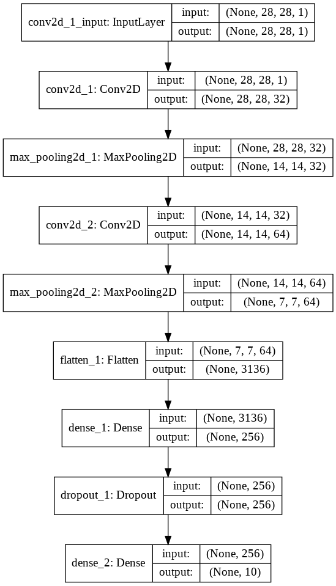
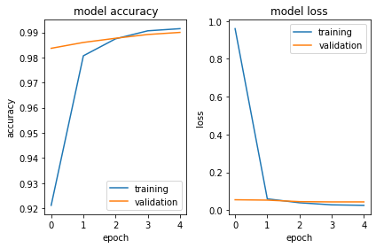
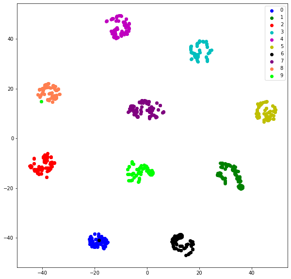
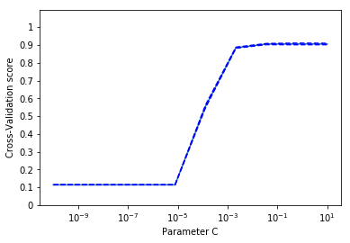
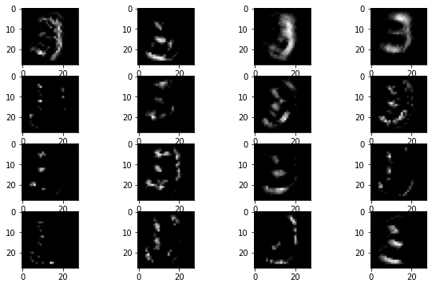

# Neural_net_CNN_Autoencoder
In this project I worked on personalized handwritten datasets as well as standard MNIST dataset. I used deep learning Keras API

This mini project is credited during the course titled "Data Science and Machine Learning",taught by [Dr. Sumeet Agrawal](https://web.iitd.ac.in/~sumeet/) IIT Delhi.

[Assignment](http://web.iitd.ac.in/~sumeet/A4_20.pdf)

**Model**

**Accuracy**

**TSE Visualization**

**optimizing parametrs for the model**

**Visualizing the hidden layers output**

For more information on methodology used and accuracy achieved please find my [Report](https://github.com/deepacefic/Neural_net_CNN_Autoencoder/blob/master/Report.pdf)
